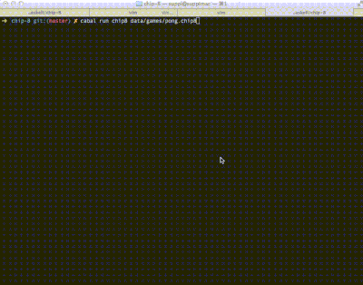

HIP-8
=====

A purely functional toy emulator for the CHIP-8 system written in Haskell

### Videos

> - [Playing Pong on Youtube](https://www.youtube.com/watch?v=scmHayBvdHw)
> - [Playing Tetris on Youtube](https://www.youtube.com/watch?v=WzFXH5XzN7A)

